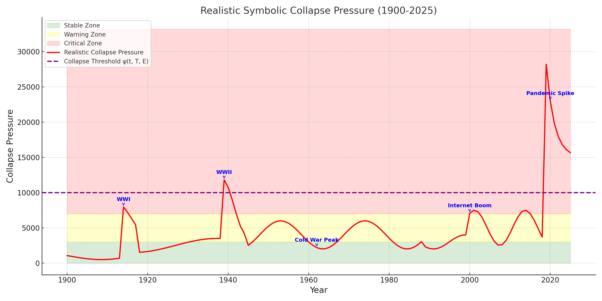

# Symbolic Collapse Model — Visual Walkthrough

Welcome to the visual and conceptual guide for the Symbolic Collapse Model. This guide explains the framework using diagrams, visual metaphors, and sample scenarios.

---

## 1. Core Formula (Collapse Pressure)

**Equation:**

\[
\mathcal{C} = \frac{I \cdot S \cdot P}{T \cdot E}
\]

Where:

- \(I\): Information Load
- \(S\): Symbolic Abstraction
- \(P\): Polarization
- \(T\): Transmission Fidelity
- \(E\): Epistemic Coherence

---

## 2. Fractal Collapse Structure

The collapse formula applies across levels:
- Individuals
- Institutions
- Civilizations

Each layer acts like a node in a **fractal network**, where overload at one level cascades into others. Think of it like a **Sierpiński triangle** fracturing over time.

---

## 3. Threshold Function

Collapse occurs when:

\[
\mathcal{C} \geq \Psi(t, T, E)
\]

Where \(\Psi\) represents the system’s ability to handle symbolic strain. It decays over time under stress (entropy or disinformation).

---

## 4. Visual Zones

Green = Stable  
Yellow = Warning  
Red = Critical collapse pressure

---

## 5. Interactive Simulator

You can use the symbolic_collapse_simulator.ipynb to experiment with:

- High abstraction but low polarization
- High information flow with high fidelity
- System breakdown under false certainty

Try adjusting values to simulate real-world events (e.g., 2020 pandemic, AI social disruption).

---

## 6. Roadmap

Planned additions:

- Real-time web dashboard
- Regional collapse mapping
- Historical collapse backtesting
- Education modules for institutions

---

## License

All contents are available under [CC BY-NC-SA 4.0](https://creativecommons.org/licenses/by-nc-sa/4.0/)

